# **We Discuss Music**

Welcome to **We Discuss Music** - your go-to blog for passionate music enthusiasts! &#127925;

The platform offers a vibrant hub where music lovers gather to listen and discuss themes curated by our site admins. Through the integrations of the Spotify API, we bring you hand-picked playlists that beautifully complement our posts.

**Explore Music**

As a visitor, discover and explore our diverse array of ever growing posts; each with its own theme, curated playlists and lively user discussions. Thanks to the embedded Spotify player you can even get a taste for and enjoy the playlists directly on our site.

**Join the Conversation**

Register an account with us and join in on the conversations! Share your thoughts, exchange ideas, and talk about your favourite songs with other music aficionados.

To access the live site, you can click [**here**](https://we-rate-music-simplified-c7886543742e.herokuapp.com/).

## **Table of Contents**

1. [Goals](#goals)
2. [Database Modelling](#database-modelling)
3. [Features:](#features)
   - [Season Posts](#season-posts)
   - [Add Playlists](#add-playlists)
   - [Spotify API Integration](#spotify-api-integration)
   - [Comments](#comments)
   - [Reply to Comments](#reply-to-comments)
4. [Future Features/Roadmap](#future-featuresroadmap)
5. [Testing](#testing)
   - [W3C Markup Validation](#w3c-markup-validation)
   - [W3C CSS Validation](#w3c-css-validation)
   - [JS Hint](#js-hint)
   - [Pylint-Django](#pylint-django)
6. [Challenges & Bugs](#challenges—bugs)
7. [Technologies Used](#technologies-used)
8. [Deployment](#deployment)
9. [Creating the Heroku app](#creating-the-heroku-app)
10. [Development](#development)
11. [Credits](#credits)

## **Goals**

## **Database Modelling**

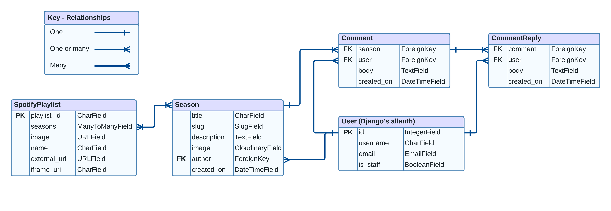

## **Features**

### Season Posts

At its foundation the Season Posts are what drive the platform. Each post revolves around a specific musical theme, put together by dedicated site administrators. The posts house the Spotify playlists themselves and its discussions between users.

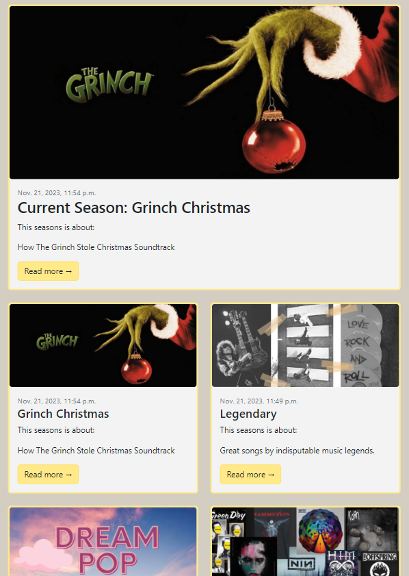

The posts are paginated every four posts, this speeds up loads times and ensures minimising scrolling for an overall better user experience. It is also worth mentioning that the most recent post is always featured on top of the page with a larger image, even throughout pagination.

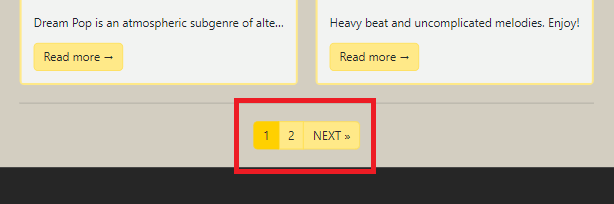

For even greater convenience to the user; all Season posts can be found and are clickable on a widget, located to the right of the page (bottom - on mobile).

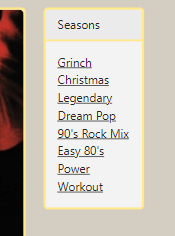

Only site admins have access to the "Create Season" button in the navbar:

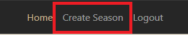

And once clicked admins are taken to the page where they can create a new Season post, where they can add a title, a description and a cover image to display to their users.

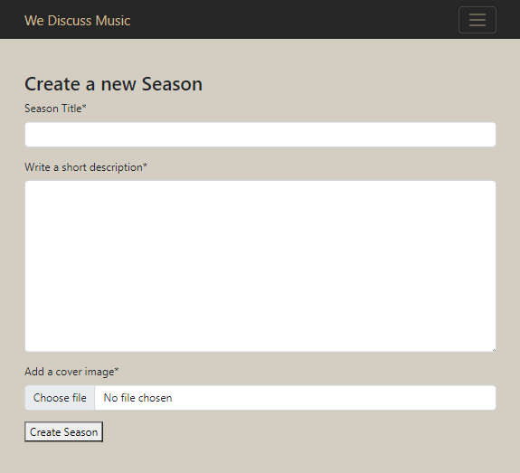

### Add Playlists

As an admin, once a Season post has been created you can choose to add playlists from Spotify to display in your posts.

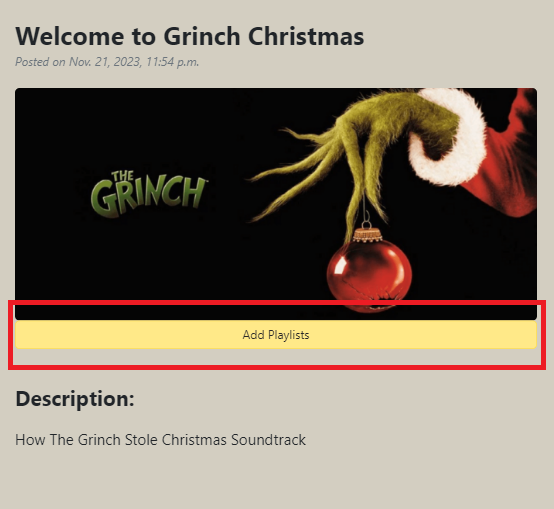

A parameter selection is present, of which you can choose "Playlist" or "Album" or both, depending on what it is you are looking for.

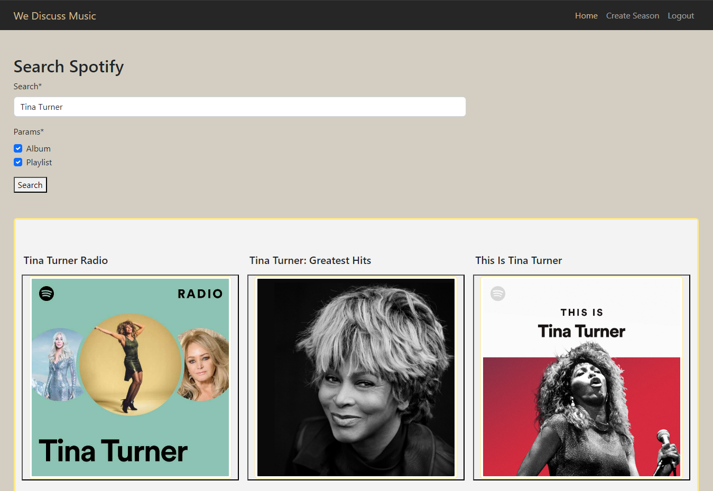

Search results can be clicked and the playlist can be listened to directly on the platform.

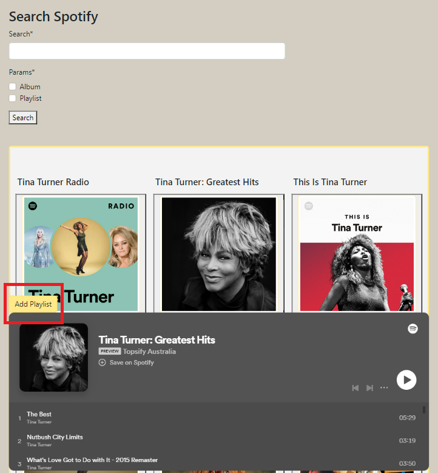

Once happy with the selection, the "Add Playlist" button can be pressed to activate a confirmation modal, before then finally adding the playlist/album to the Season post.

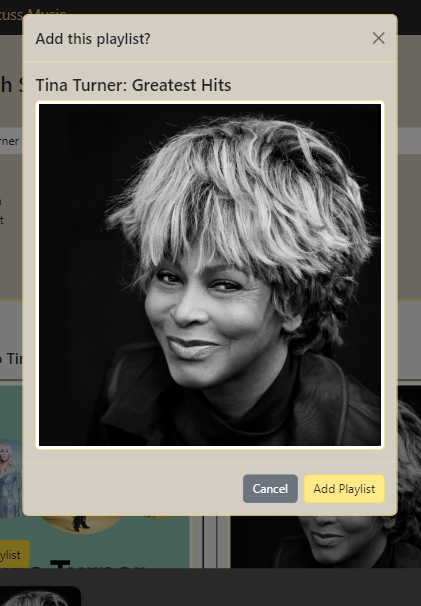

### Spotify API Integration

The Spotify API works twofold; on one end it allows our site administrators to search for playlists and albums from Spotify directly and display them on the platform. On the other end it allows users to experience the music without ever leaving the platform through the embedded player. Spotify's embedded "iFrame" player can be found on every page that albums/playlists display, so that's the search page for admins and in the Season posts for everyone.

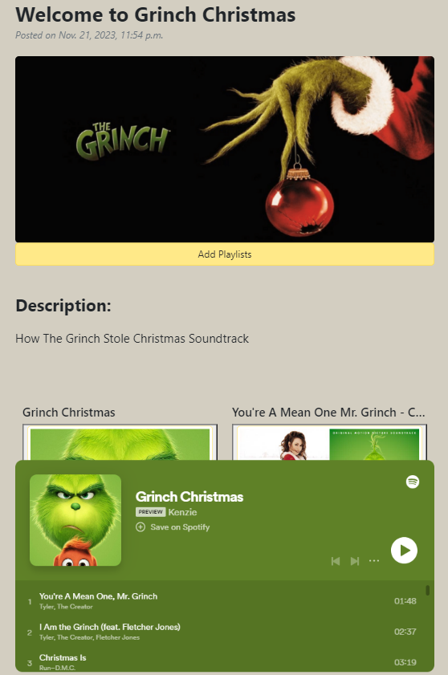

### Comments

### Reply to Comments

## **Future Features/Roadmap**

## **Testing**

<!-- LIGHTHOUSE TESTING?! -->

### **W3C Markup Validation**

[W3C Markup Validation Services](https://validator.w3.org/) were used to check every page throughout the application, below are the reports for each; and if any errors were present, they are included below:

All Users Accessible sites:
[Homepage](https://validator.w3.org/nu/?doc=https%3A%2F%2Fwe-rate-music-simplified-c7886543742e.herokuapp.com%2F): No errors or warnings to show.
[Sign-up page](https://validator.w3.org/nu/?doc=https%3A%2F%2Fwe-rate-music-simplified-c7886543742e.herokuapp.com%2Faccounts%2Fsignup%2F): Errors on Django's own form element - ignored
[Login page](https://validator.w3.org/nu/?doc=https%3A%2F%2Fwe-rate-music-simplified-c7886543742e.herokuapp.com%2Faccounts%2Flogin%2F): No errors or warnings to show.
[Logout page](https://validator.w3.org/nu/?doc=https%3A%2F%2Fwe-rate-music-simplified-c7886543742e.herokuapp.com%2Faccounts%2Flogout%2F): No errors or warnings to show.
[Season Post Detail View](https://validator.w3.org/nu/?doc=https%3A%2F%2Fwe-rate-music-simplified-c7886543742e.herokuapp.com%2Fseason%2Frock-music%2F): No errors or warnings to show.

Staff User Accessible sites:
[Create Season Post View](https://validator.w3.org/nu/?doc=https%3A%2F%2Fwe-rate-music-simplified-c7886543742e.herokuapp.com%2Fseason%2Fcreate%2F): Errors on Django's own form element - ignored
[Spotify API Search](https://validator.w3.org/nu/?doc=https%3A%2F%2Fwe-rate-music-simplified-c7886543742e.herokuapp.com%2Fseason%2Frock-music%2Fspotify-search): Errors on Django's own form element - ignored

### **W3C CSS Validation**

All of my own custom CSS passed validation, however 16 errors and 258 warnings were found overall as seen [here](https://jigsaw.w3.org/css-validator/validator?uri=https%3A%2F%2Fwe-rate-music-simplified-c7886543742e.herokuapp.com%2F&profile=css3svg&usermedium=all&warning=1&vextwarning=&lang=en). This was safetly ignored as it was a direct download from [Start Bootstrap's Theme](https://startbootstrap.com/template/blog-home).

### **JS Hint**

[JS Hint](https://jshint.com/) was used to test the custom static script.js file, with no notable errors.\
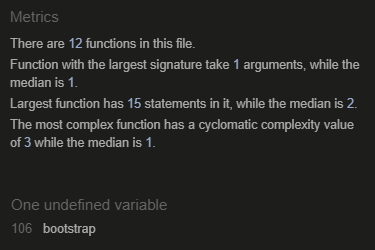

### **Pylint-Django**

[Pylint-Django](https://pypi.org/project/pylint-django/) was used to run on every python file in the apps part of the project, the list of files and their respective results are below, including any complaints, if any:

- blog/admin.py: 10/10
- blog/apps.py: 10/10
- blog/forms.py: 10/10
- blog/models.py: 10/10
- blog/spotify_api.py: 9.11/10
  - 35:13: W3101: Missing timeout argument for method 'post' can cause your program to hang indefinitely (missing-timeout)
  - 51:0: R0914: Too many local variables (17/15) (too-many-locals)
  - 89:12: W0622: Redefining built-in 'id' (redefined-builtin)
  - 68:14: W3101: Missing timeout argument for method 'get' can cause your program to hang indefinitely (missing-timeout)
  - 11:4: W0611: Unused import env (unused-import)
- blog/urls.py: 10/10
  - Note: "# pylint: disable=line-too-long" was added to ignore long lines as it made sense to do so here.
- blog/views.py: 9.9/10
  - 146:22: W0612: Unused variable 'created' (unused-variable)

### **Process**

## **Challenges & Bugs**

### **Challenges**

### **Fixed Bugs**

### **Unfixed Bugs**

## **Technologies Used**

### **Languages**

- HTML
- CSS
- JavaScript
- Python 3.11.1
- Bootstrap 5

### **Libraries**

asgiref==3.7.2
Django==4.2.6
python-dotenv==1.0.0
sqlparse==0.4.4

### **Tools**

- [**Heroku**](https://www.heroku.com/) - Used to house the in-browser app
- [**Lucid Charts**](https://www.lucidchart.com/) - Used to create the flow chart diagram

## **Deployment**

The project was deployed on GitHub pages from the ‘Main Branch Source Code’ using the following steps:

- ‘git add .’, ‘git commit” and ‘git push’ commands were issued one final time when the project was ready and finished.
- On Github the repository for the project was selected.
- Click the ‘Settings’ tab.
- On the left; select ‘Pages’.
- From here; select the source as ‘Main Branch’.
- Click ‘Save’.

GitHub may take a few minutes to deploy the website so be patient.

You can view the application on Heroku by clicking [**here**](https://we-rate-music-simplified-c7886543742e.herokuapp.com/).

## **Creating the Heroku app**

Before creating the Heroku app:

1. Make sure you have a file named “requirements.txt” in your main project folder.
2. Open the command line and navigate to your project folder.
3. Run the command “pip3 freeze > requirements.txt”.
   - This will create a list of dependencies used in the project for Heroku to set up the environment later.
4. Push these latest changes, including the requirements.txt file, to your GitHub repository (or any other preferred Git service).

Now, you can proceed with creating the Heroku app:

1. Sign in to your Heroku account (if you don’t already have one, create a free account on [Heroku](https://www.heroku.com/) first).
2. Once logged in, click on the “Create new app” button on your Heroku dashboard and follow the subsequent steps.
3. From within your newly created app, click the “Settings” tab.
4. Scroll down to the section labeled “Config Vars” and click on “Reveal Config Vars”.
5. In the “Key” field enter “CREDS”.
6. In the “Value” field copy and paste the entire contents of the creds.json file from your project.
   - This will securely provide the necessary credentials to access your Google Sheets API.
7. Add another Key/Value of “PORT” and “8000” respectively.
8. Scroll down to the section labeled “Buildpacks” and click “Add buildpack”.
9. Add Python and NodeJS and make sure they are shown in that order.
10. Navigate to the “Deploy” tab at the top of the page.
11. Choose your preferred deployment method (GitHub, for example) and connect it to your app.
12. Search for the repository name in the dropdown menu and select it.
13. Click “Connect”.
14. Then, either select “Enable Automatic Deploys” or “Deploy Branch”; the difference is that one automatically deploys the app every time a change is pushed to GitHub and the other needs to be redeployed manually every time.
15. You should now have a working Heroku app on your dashboard.

## **Development**

If you would like to contribute to this project, please follow the following steps:

From GitHub:

1. Create a separate branch for your development work
2. Make any necessary modifications and improvements to the project on your branch.
3. Create a pull request with a clear and detailed description of the changes you have made.
4. I will review your changes and provide feedback if needed.
5. If everything looks good, I will merge the changes into the main branch of the project.

If you wish to use any parts of the project for your project, you are welcome to do so. However, please give credit to me by linking my GitHub profile.

Thank you for your interest in the project, and I look forward to any contributions or acknowledgments!

## **Credits**

- A lot of initial code inspiration came from Code Institute's "Django Blog" walkthrough project
- https://startbootstrap.com/template/blog-home - Template for homepage
- https://startbootstrap.com/template/blog-post - Template for individual blog entries
- https://www.youtube.com/watch?v=WAmEZBEeNmg - This video got me off the ground when integrating the Spotify API

### **Content**

- [Django Documentation](https://docs.djangoproject.com/en/4.2/)
- [Mozilla Developer](https://developer.mozilla.org/en-US/docs/Learn/Server-side/Django)
- [Bootstrap 5 Documentation](https://getbootstrap.com/docs/5.3/getting-started/introduction/)
- [Spotify API Documentation](https://developer.spotify.com/documentation/web-api)
- [Cloudinary Documentation](https://cloudinary.com/documentation)
- [Jinja Documentation](https://jinja.palletsprojects.com/en/3.1.x/templates/)
- [WhiteNoise Django Documentation](https://whitenoise.readthedocs.io/en/latest/django.html)
- [Stack Overflow](https://stackoverflow.com/) - general enquiries/syntax
- [W3Schools](https://www.w3schools.com/) - general enquiries/syntax
