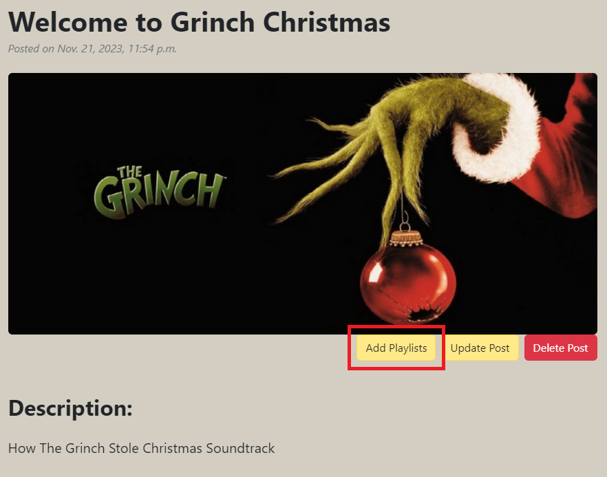

# **We Discuss Music**

Welcome to **We Discuss Music** - your go-to blog for passionate music enthusiasts! &#127925;

The platform offers a vibrant hub where music lovers gather to listen and discuss themes curated by our site admins. Through the integrations of the Spotify API, we bring you hand-picked playlists that beautifully complement our posts.

**Explore Music**

As a visitor, discover and explore our diverse array of ever-growing posts; each with its own theme, curated playlists and lively user discussions. Thanks to the embedded Spotify player you can even get a taste for and enjoy the playlists directly on our site.

**Join the Conversation**

Register an account with us and join in on the conversations! Share your thoughts, exchange ideas, and talk about your favourite songs with other music aficionados.

To access the live site, you can click [**here**](https://we-rate-music-simplified-c7886543742e.herokuapp.com/).

## **Table of Contents**

1. [Goals](#goals)
2. [Wireframes, Design and Agile Development](#wireframes-design-and-agile-development)
3. [Database Modelling](#database-modelling)
4. [Features:](#features)
   - [Season Posts](#season-posts)
   - [Add Playlists](#add-playlists)
   - [Spotify API Integration](#spotify-api-integration)
   - [The Comment Section](#the-comment-section)
   - [Triggered Bootstrap Alerts](#triggered-bootstrap-alerts)
5. [Future Features/Roadmap](#future-featuresroadmap)
6. [Testing](#testing)
   - [W3C Markup Validation](#w3c-markup-validation)
   - [W3C CSS Validation](#w3c-css-validation)
   - [JS Hint](#js-hint)
   - [Pylint-Django](#pylint-django)
7. [Challenges & Bugs](#challenges—bugs)
8. [Technologies Used](#technologies-used)
9. [Deployment](#deployment)
10. [Creating the Heroku app](#creating-the-heroku-app)
11. [Development](#development)
12. [Credits](#credits)

## **Goals**

Site Admin Goals

- **Foster a Music Community:** gather a vibrant community of music lovers by sharing a diverse range of playlists.
- **Organise Playlists:** Group playlists into their own themed blog posts, creating interesting and engaging content for users.
- **Engage with Other Users:** Join in on conversations with users all over the world to receive feedback and draw inspiration for future posts.

Site User Goald

- **Discover New Music:** Explore themed blog posts and discover new playlists both new and old.
- **Participate in Conversations:** Share your opinions on post themes, playlists and future ideas.
- **Enjoy a Handcrafted Library of Playlists:** Access a library of engaging themed blog posts, each with its own set of playlists to listen to on-site.

<a href="#table-of-contents"><em>(Back to top)</em></a>

---

## **Wireframes, Design and Agile Development**

**Wireframe**

The wireframes were made utilising the [Balsamiq Wireframe](https://balsamiq.com/) tool, focusing primarily on the landing pages of desktop and mobile views. Once a suitable pre-made Bootstrap theme was found on [Start Bootstrap](https://startbootstrap.com/template/blog-home) developing and matching the rest of the web application to be in line with the initial idea was made easy.

**The Agile Method**

For this project, I opted to primarily use my "Project Sprints" board (pictured below) on GitHub. This was a great tool planning my days and weeks ahead. It gave me a great overview of what was absolutely required and if time was left, what the next most impactful thing would be - to work on for the rest of the assigned time. However, with larger or more long-term projects, this method would encounter some issues. So, in hindsight, I will probably find another way in the future.

As a secondary view, I also had the classic Kanban view of my project's user stories.

<a href="#table-of-contents"><em>(Back to top)</em></a>

---

## **Database Modelling**

### **The Models**

#### **Season**

The Season model represents the blog posts, it includes the following attributes:

- "title" (CharField): The title of the blog post.
- "slug" (SlugField): A unique identifier used as part of the URLs.
- "description" (TextField): The description and information on the theme of the Season post.
- "image" (CloudinaryField): An image field for storing Season post-cover images on the Cloudinary servers.
- "author" (ForeignKey - User): Reference to the User that created the Season post.
- "created_on" (DateTimeField): A timestamp for the creation date and time of the post.

#### **SpotifyPlaylist - Custom Model**

The SpotifyPlaylist model stores playlist data added by using the Spotify API. Its attributes are:

- "playlist_id" (CharField - PrimaryKey): Spotify's unique identifiers for each album/playlist.
- "seasons" (ManyToManyField - Season): Multiple playlists can be a part of a Season post and multiple Season posts can contain the same playlist.
- "image" (URLField): A URL link to the image for the playlist (by Spotify).
- "name" (CharField): The name of the playlist/album.
- "external_url" (URLField): External URL link to the playlist/album on Spotify.
- "iframe_uri" (Charfield): URI reference for the embedded Spotify player.

#### **Comment**

The Comment model stores users' comments on Season posts. It includes the following attributes:

- "season" (ForeignKey - Season): Reference to the Season post the comment was posted on.
- "user" (ForeignKey - User): Reference to the user that posted the comment.
- "body" (TextField): The content of the comment.
- "created_on" (DateTimeField): A timestamp for the creation date and time of the comment.

#### **CommentReply**

The CommentReply model stores users' replies given to comments. The attributes are identical to the Comment model with one key difference:

- "comment" (ForeignKey - Comment): In reference to the comment, this is instead of the "season" attribute from the Comment model.

<a href="#table-of-contents"><em>(Back to top)</em></a>

---

## **Features**

### Season Posts

At its foundation, the Season Posts are what drive the platform. Each post revolves around a specific musical theme, put together by dedicated site administrators. The posts house the Spotify playlists themselves and their discussions between users.

These posts are paginated, showing four posts per page to speed up load times and ensure minimising scrolling for an overall better user experience. It is also worth mentioning that the most recent post is always featured on top of the page with a larger image, regardless of pagination.

For even greater convenience to the user; all Season posts can be found and are clickable on a widget, located to the right of the page (bottom on mobile).

The "Create Season" button in the navbar is exclusively available to site administrators.

Once clicked, admins are directed to the Season post form page where they can create a new post, adding a title, description and a cover image to display to users.

### Add Playlists

Once Season posts are created, admins can add playlists from Spotify to display in their posts.

They can narrow down their search by specifiying parameters - "Playlist" or "Album" or both.

Search results can be clicked and the playlist can be listened to directly on the platform.

The "Add Playlist" button can be pressed to activate a confirmation modal, before then finally adding the playlist/album to the Season post.

### Spotify API Integration

The Spotify API works twofold; enabling site administrators to search for and display Spotify playlists/albums on Season posts and allowing all users to experience the music without ever leaving the platform through the embedded player.

### The Comment Section

Registered users can engage in the comment section by sharing their opinions.

Icons below user's own comments allow for them to be edited or deleted.

The "edit" icon:

Clicking the "trash" icon activates a confirmation modal:

Registered users can also reply to specific comments to better drive a conversation.

All comments and replies show if the user is an admin.

### Triggered Bootstrap Alerts

Bootstrap alerts are triggered for various actions across the platform, giving users feedback on successful actions and thus improving user experience. The events that currently have alerts assigned to them are as follows:

- Successful login.
- When the user logs out.
- Updating Season posts.
- Deleting Season posts.
- Adding Spotify playlist to posts.
- Updating a comment.
- Deleting a comment.

Using custom JavaScript, the alerts remain on screen for 2.5 seconds before automatically closing.

### Responsive Design

<a href="#table-of-contents"><em>(Back to top)</em></a>

---

## **Future Features/Roadmap**

In future sprints, the application will include several new features:

- **Edited Comments:** Comments edited after posting will display a "_(edited)_" tag with the original text available when the tag is clicked.
- **Spotify iFrame Close Button:** This will allow users to close the Spotify iFrame player for a much-improved user experience. Currently, the iFrame player can only be closed by refreshing the page.
- **User Profiles:** Users will have the ability to customise their profiles with profile pictures - making the comments section more vibrant.
- **Comment Upvotes:** Users can like/upvote a comment. Comments that rank higher will display higher.
- **CRUD for Replies:** All CRUD (Create, Read, Update, Delete) operations will be available on replies. The "_(edited)_" feature from comments will also be made available.
- **Admin Playlist Management:** Admin users will gain the ability to delete unwanted playlists directly from posts without requiring access to the admin panel.

<a href="#table-of-contents"><em>(Back to top)</em></a>

---

## **Testing**

### **Lighthouse Testing**

<u>Desktop</u>

<u>Mobile</u>

This test revealed performance issues, primarily due to image sizing and unused CSS.

### **W3C Markup Validation**

[W3C Markup Validation Services](https://validator.w3.org/) were used to check every page throughout the application, below are the reports for each; and if any errors were present, they are included below:

All Users Accessible sites:
[Homepage](https://validator.w3.org/nu/?doc=https%3A%2F%2Fwe-rate-music-simplified-c7886543742e.herokuapp.com%2F): No errors or warnings to show.
[Sign-up page](https://validator.w3.org/nu/?doc=https%3A%2F%2Fwe-rate-music-simplified-c7886543742e.herokuapp.com%2Faccounts%2Fsignup%2F): Errors on Django's own form element - ignored
[Login page](https://validator.w3.org/nu/?doc=https%3A%2F%2Fwe-rate-music-simplified-c7886543742e.herokuapp.com%2Faccounts%2Flogin%2F): No errors or warnings to show.
[Logout page](https://validator.w3.org/nu/?doc=https%3A%2F%2Fwe-rate-music-simplified-c7886543742e.herokuapp.com%2Faccounts%2Flogout%2F): No errors or warnings to show.
[Season Post Detail View](https://validator.w3.org/nu/?doc=https%3A%2F%2Fwe-rate-music-simplified-c7886543742e.herokuapp.com%2Fseason%2Frock-music%2F): No errors or warnings to show.

Staff User Accessible sites:
[Create Season Post View](https://validator.w3.org/nu/?doc=https%3A%2F%2Fwe-rate-music-simplified-c7886543742e.herokuapp.com%2Fseason%2Fcreate%2F): Errors on Django's own form element - ignored
[Spotify API Search](https://validator.w3.org/nu/?doc=https%3A%2F%2Fwe-rate-music-simplified-c7886543742e.herokuapp.com%2Fseason%2Frock-music%2Fspotify-search): Errors on Django's own form element - ignored

### **W3C CSS Validation**

All of my own custom CSS passed validation, however, 16 errors and 258 warnings were found overall as seen [here](https://jigsaw.w3.org/css-validator/validator?uri=https%3A%2F%2Fwe-rate-music-simplified-c7886543742e.herokuapp.com%2F&profile=css3svg&usermedium=all&warning=1&vextwarning=&lang=en). This was safely ignored as it was a direct download from [Start Bootstrap's Theme](https://startbootstrap.com/template/blog-home).

### **JS Hint**

[JS Hint](https://jshint.com/) was used to test the custom static script.js file, with no notable errors.\

### **Pylint-Django**

[Pylint-Django](https://pypi.org/project/pylint-django/) was used to run on every python file in the apps part of the project, the list of files and their respective results are below, including any complaints, if any:

- blog/admin.py: 10/10
- blog/apps.py: 10/10
- blog/forms.py: 10/10
- blog/models.py: 10/10
- blog/spotify_api.py: 9.11/10
  - 35:13: W3101: Missing timeout argument for method 'post' can cause your program to hang indefinitely (missing-timeout)
  - 51:0: R0914: Too many local variables (17/15) (too-many-locals)
  - 89:12: W0622: Redefining built-in 'id' (redefined-builtin)
  - 68:14: W3101: Missing timeout argument for method 'get' can cause your program to hang indefinitely (missing-timeout)
  - 11:4: W0611: Unused import env (unused-import)
- blog/urls.py: 10/10
  - Note: "# pylint: disable=line-too-long" was added to ignore long lines as it made sense to do so here.
- blog/views.py: 9.83/10

  - 65:8: W0201: Attribute 'object' defined outside --init-- (attribute-defined-outside-init)
  - 170:22: W0612: Unused variable 'created' (unused-variable)

- blog/tests/test_forms.py: 10/10
- blog/tests/test_models.py: 10/10
- blog/tests/test_urls.py: 10/10
- blog/tests/test_views.py: 9.94/10
  - 10:0: R0904: Too many public methods (29/20) (too-many-public-methods) - in hindsight and given more time, I would have written this test file very differently.

### **Process**

<a href="#table-of-contents"><em>(Back to top)</em></a>

---

## **Challenges & Bugs**

### **Challenges**

**Project Scope**

The biggest challenge I had during this project was realising, deep into my project, that initial plans were completely out of scope for the amount of time given. I initially worked on the beginnings of a social media platform akin to Instagram. Realising the depth of testing and creating something polished in the amount of time given was going to be an impossible task, I had to go back to the drawing board and align myself with a "Minimum Viable Product" in the time left. In the end, I am happy with my decision and I have learned a great deal along the way.

**Testing Testing Testing**

Using Django's Unit Test for the first time was a relatively challenging and rocky road in itself. Some, if not most, tests were incredibly straightforward, but there were a few tests that took me a lot longer than I would've liked. Testing Django's views was on the more difficult side of the scale. I wanted to challenge myself by thoroughly testing the project, and even though I didn't manage coverage of 100% - I am very pleased with the coverage of 92% (using "coverage report")

### **Fixed Bugs**

Unfortunately, or fortunately rather - I do not have any notable bug fixes to talk about. This is because most of the notable bugs occurred during my initial project (before the restart) and due to time constraints I simplified a lot of this project and thus didn't run into any major issues.

### **Unfixed Bugs**

To the best of my knowledge no known, unfixed bugs exist.

<a href="#table-of-contents"><em>(Back to top)</em></a>

---

## **Technologies Used**

### **Languages**

- HTML
- CSS
- JavaScript
- Python 3.11.1
- Bootstrap 5

### **Tools**

- [**Heroku**](https://www.heroku.com/) - Used to house the in-browser app
- [**Lucid Charts**](https://www.lucidchart.com/) - Used to create the flow chart diagram
- [**Balsamiq Wireframes**](https://balsamiq.com/) - Used to create the initial wireframes for the project

<a href="#table-of-contents"><em>(Back to top)</em></a>

---

## **Deployment**

The project was deployed on GitHub pages from the ‘Main Branch Source Code’ using the following steps:

- ‘git add .’, ‘git commit” and ‘git push’ commands were issued one final time when the project was ready and finished.
- On Github the repository for the project was selected.
- Click the ‘Settings’ tab.
- On the left; select ‘Pages’.
- From here; select the source as ‘Main Branch’.
- Click ‘Save’.

GitHub may take a few minutes to deploy the website so be patient.

You can view the application on Heroku by clicking [**here**](https://we-rate-music-simplified-c7886543742e.herokuapp.com/).

<a href="#table-of-contents"><em>(Back to top)</em></a>

---

## **Creating the Heroku app**

Before creating the Heroku app, and within your project:

1. Make sure you have a file named “requirements.txt” in your main project folder.
2. Open the command line and navigate to your project folder.
3. Run the command “pip3 freeze > requirements.txt”.
   - This will create a list of dependencies used in the project for Heroku to set up the environment later.
4. Create a "Procfile" in the project's main directory with "web: gunicorn we_rate_music.wsgi" in it - this allows Heroku to properly configure to a gunicorn web app.
5. In the project's settings.py file configure the ALLOWED_HOSTS list to include 'your_app_name123.herokuapp.com'.
6. Push these latest changes, including the requirements.txt file, to your GitHub repository (or any other preferred Git service).

Spotify for Developers:

1. Login to your Spotify account on [Spotify for Developers](https://developer.spotify.com/) or create a free account first.
2. Go to your Dashboard.
3. Click on "Create app".
4. Give the app a name, description, and a redirect URI of your local host.
5. For "Which API/SDKs are you planning to use?" - select Web API.
6. Agree to the terms and conditions (preferably read them first!).
7. Back on your Dashboard; select the app you just made and click "Settings".
8. Take note of your Client ID and Client Secret (do not share this!).

Cloudinary:

1. Create a free account on [Cloudinary](https://www.cloudimage.io/en/home).
2. Find the "Settings" tab.
3. From here, click "Access Keys".
4. Take note of your API Key and API Secret (again, do not share!).

ElephantSQL:

As Django's internal database system would reset every time Heroku refreshes your app while idle, it is best to use a service like [ElephantSQL](https://www.elephantsql.com/).

1. Create a free account.
2. From the "Instances" dashboard - Create a New Instance.
3. Name your app, and choose your tier (free is okay for now).
4. Select the closest server to your region.
5. Click "Create instance".
6. Back on your Dashboard - select the newly created instance
7. Under "Details" copy the URL field (not to be shared!)

Now, you can proceed with creating the Heroku app:

1. Sign in to your Heroku account (if you don’t already have one, create a free account on [Heroku](https://www.heroku.com/) first).
2. Once logged in, click on the “Create new app” button on your Heroku dashboard and follow the subsequent steps.
3. From within your newly created app, click the “Settings” tab.
4. Scroll down to the section labeled “Config Vars” and click on “Reveal Config Vars”.
5. Configure the following key-value pairs:
   - CLIENT_ID: This is your Spotify Client ID
   - CLIENT_SECRET: This is your Spotify Client Secret
   - CLOUDINARY_URL: The format of this URL is as follows - 'cloudinary://{Your API KEY}:{Your API Secret}'
   - DATABASE_URL: This is your ElephantSQL URL
   - SECRET_KEY: This is your Django project's secret key
   - DISABLE_COLLECTSTATIC: 1
   - PORT: 8000
6. Navigate to the “Deploy” tab at the top of the page.
7. Choose your preferred deployment method (GitHub, for example) and connect it to your app.
8. Search for the repository name in the dropdown menu and select it.
9. Click “Connect”.
10. Then, either select “Enable Automatic Deploys” or “Deploy Branch”; the difference is that one automatically deploys the app every time a change is pushed to GitHub and the other needs to be redeployed manually every time.
11. You should now have a working Heroku app on your dashboard.

<a href="#table-of-contents"><em>(Back to top)</em></a>

---

## **Development**

If you would like to contribute to this project, please follow the following steps:

From GitHub:

1. Create a separate branch for your development work
2. Make any necessary modifications and improvements to the project on your branch.
3. Create a pull request with a clear and detailed description of the changes you have made.
4. I will review your changes and provide feedback if needed.
5. If everything looks good, I will merge the changes into the main branch of the project.

If you wish to use any parts of the project for your project, you are welcome to do so. However, please give credit to me by linking my GitHub profile.

Thank you for your interest in the project, and I look forward to any contributions or acknowledgments!

<a href="#table-of-contents"><em>(Back to top)</em></a>

---

## **Credits**

- A lot of initial code inspiration came from Code Institute's "Django Blog" walkthrough project
- https://startbootstrap.com/template/blog-home - Template for homepage
- https://startbootstrap.com/template/blog-post - Template for individual blog entries
- https://www.youtube.com/watch?v=WAmEZBEeNmg - This video got me off the ground when integrating the Spotify API

### **Content**

- [Django Documentation](https://docs.djangoproject.com/en/4.2/)
- [Mozilla Developer](https://developer.mozilla.org/en-US/docs/Learn/Server-side/Django)
- [Bootstrap 5 Documentation](https://getbootstrap.com/docs/5.3/getting-started/introduction/)
- [Spotify API Documentation](https://developer.spotify.com/documentation/web-api)
- [Cloudinary Documentation](https://cloudinary.com/documentation)
- [Jinja Documentation](https://jinja.palletsprojects.com/en/3.1.x/templates/)
- [WhiteNoise Django Documentation](https://whitenoise.readthedocs.io/en/latest/django.html)
- [Stack Overflow](https://stackoverflow.com/) - general enquiries/syntax
- [W3Schools](https://www.w3schools.com/) - general enquiries/syntax

<a href="#table-of-contents"><em>(Back to top)</em></a>

---
